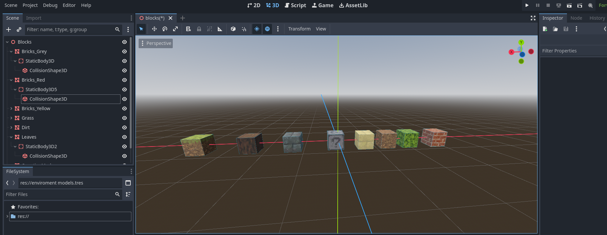
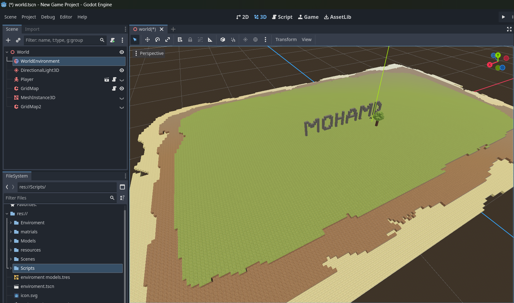
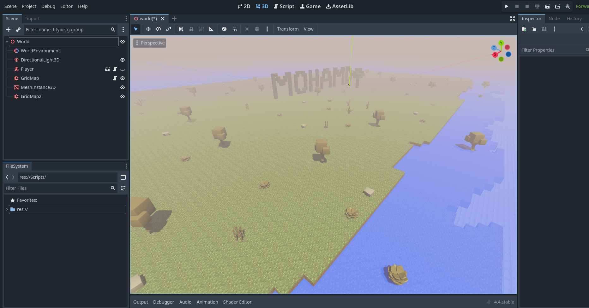
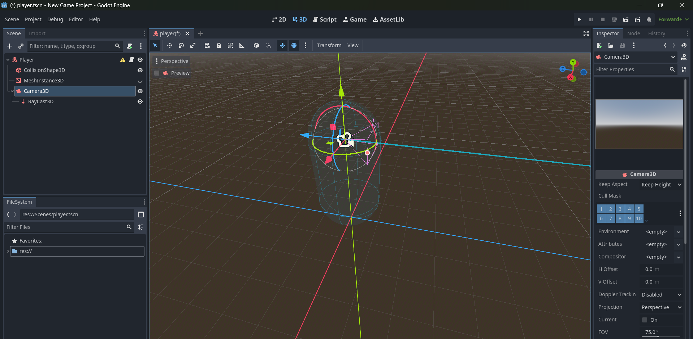
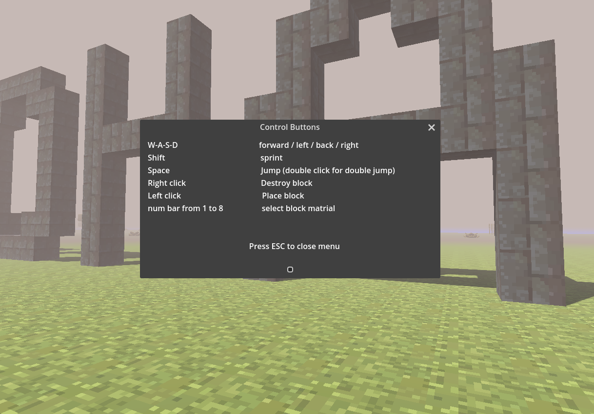

# voxel-game-project
A voxel based game with godot for a university project (Mohammd Progress)
===============================================================================================================================================
##### 26/03
This was our first session starting to work on our project which is a voxel based game (Minecraft like) using Godot game engine,
We discussed a lot of ideas of the main idea that our game will be out but we settled to nothing so we decided to leave that for later and started setting our work environment.
We downloaded Godot engine I watched a tutorial that explain some of the basics functions and buttons then we  initialized a GitHub respiratory and 
connected it to a main project that will be working on, each one of us made a branch and started experimenting with objects in the engine we figured(hardly) out how to make merging to main branch possible we finally synced everything together and made sure we have a working environment we can save and keep track of our work with.
we decided now make a some primal prototype of minecraft to learn more about the engine.

##### total time ~ 8hours
===============================================================================================================================================
#### until 15/04
I spent this time watching tutorials and trying to make small and different instances in Godot I wanted to fully understand the stuffs I was doing so it took me so much time to make basic things I sticked to a tutorial on youtube and tried to make a simple primal Minecraft variant with the basics function and so I learned more about the game engine and the game development in general here is brief summary of what I learned and implemented:
first of all I learned that the game project consist of different scenes like (world scene/ player/ enemies/ main menu/ etc..) that we create separately and then combine them and make them interact together as we see fit each scene is made of different nodes that define different characteristics about the object we are working on 
I created a scene called blocks which contain the blocks that I’ll use to build my world
  
Each block is a node with it own child nodes that define its characteristic
I took the texture of the nodes from a free online source 
Then I created a new scene I named world and built a small island from the blocks scene
  

After that I added created a new scene and added environments objects like trees bushes and rocks and added them to the world scene and added some fog and a transparent blue instance to imitate water

Here is the final result of my spooky island
  

Then I created a new scene called player and made a simple capsule with some movements to it using Godotscript 
   
I added a characteristic to it to help me identify static objects, this helped for building and destroying blocks in the world scene.
Then I added the appropriate script for the player and world scene to handle these features.
Finally I did a simple Ui to show game buttons  how to play
   

I took me a lot of time to figure out what I’m doing and why and set up and make the logic of the scenes work together perfectly 
But I have to admit moving around on the island and trying the features I implemented felt rewarding

##### total time ~ 20 hours

***
