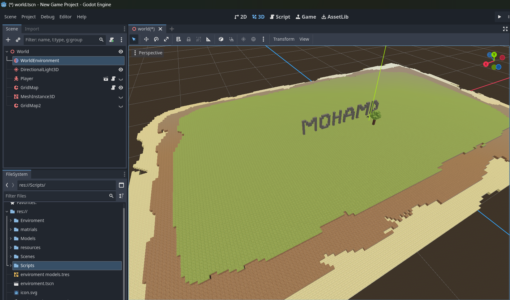
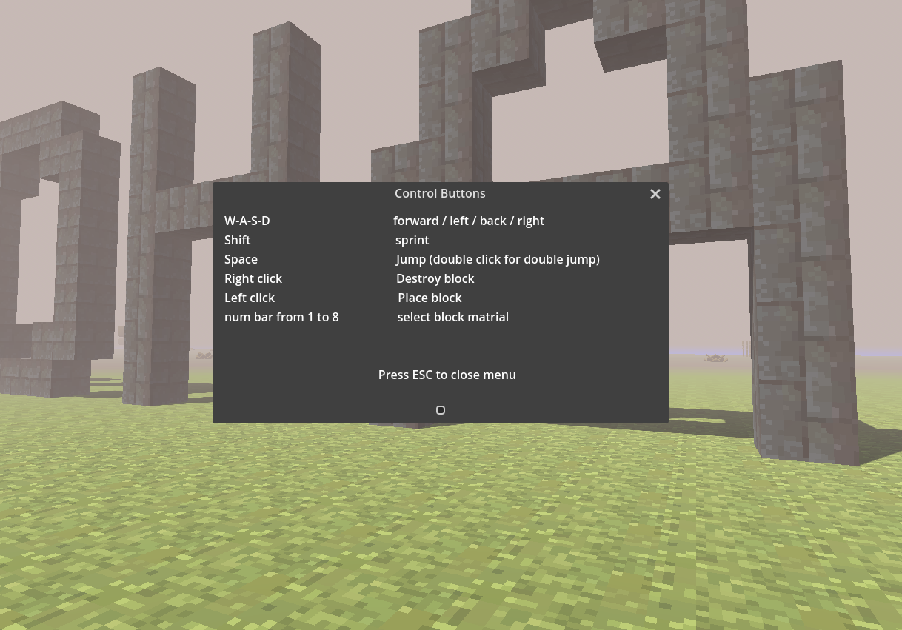

# voxel-game-project
## A voxel based game with godot for a university project (Mohammd Progress)
***
### 26/03
This was our first session starting to work on our project which is a voxel based game (Minecraft like) using Godot game engine,
We discussed a lot of ideas of the main idea that our game will be out but we settled to nothing so we decided to leave that for later and started setting our work environment.
We downloaded Godot engine I watched a tutorial that explain some of the basics functions and buttons then we  initialized a GitHub respiratory and 
connected it to a main project that will be working on, each one of us made a branch and started experimenting with objects in the engine we figured(hardly) out how to make merging to main branch possible we finally synced everything together and made sure we have a working environment we can save and keep track of our work with.
we decided now make a some primal prototype of minecraft to learn more about the engine.

#### total time ~ 8hours
***
### until 15/04
I spent this time watching tutorials and trying to make small and different instances in Godot I wanted to fully understand the stuffs I was doing so it took me so much time to make basic things I sticked to a tutorial on youtube and tried to make a simple primal Minecraft variant with the basics function and so I learned more about the game engine and the game development in general here is brief summary of what I learned and implemented:
first of all I learned that the game project consist of different scenes like (world scene/ player/ enemies/ main menu/ etc..) that we create separately and then combine them and make them interact together as we see fit each scene is made of different nodes that define different characteristics about the object we are working on 
I created a scene called blocks which contain the blocks that I’ll use to build my world
  
Each block is a node with it own child nodes that define its characteristic
I took the texture of the nodes from a free online source 
Then I created a new scene I named world and built a small island from the blocks scene
  

After that I added created a new scene and added environments objects like trees bushes and rocks and added them to the world scene and added some fog and a transparent blue instance to imitate water

Here is the final result of my spooky island
  

Then I created a new scene called player and made a simple capsule with some movements to it using Godotscript 
   
I added a characteristic to it to help me identify static objects, this helped for building and destroying blocks in the world scene.
Then I added the appropriate script for the player and world scene to handle these features.
Finally I did a simple Ui to show game buttons  how to play
   

I took me a lot of time to figure out what I’m doing and why and set up and make the logic of the scenes work together perfectly 
But I have to admit moving around on the island and trying the features I implemented felt rewarding

#### total time ~ 20 hours

***
### 29/04
this week I had meeting with my partner to discuss the game we are going to develop after a while of brain storming and pruning ideas we settled on the 1v1 multiplayer fps, we also had two meetings with two expert developers from the industry who work on indie games they gave us a good insight about the work and the game we are developing they also recommended trying some small voxel games to get inspirations from, so now the goal is set and we should start learning the tools and embark on making our game, I started watching some youtube tutorials about making multiplayer games in godot and I found out that godot have some built in multiplayer nodes and methods to support online gaming which is a good sign but the thing is all the tutorials I watched on youtube are super fast and doesn't clarify the work they are doing and the meaning of it, so we bought a udemy course that teaches godot step by step and I already started learning from there.

#### total time ~ 10hours

***
### until 13/05
in the past two weeks I was learning more about godot from a course on udemy and it was very helpful and informative yet I still feel like there is a lot I don't know, I have learned the basics and got a good undertstanding of how games are built from small parts which get composed together, but to build a good game you should pay attention to details and try to make it feel alive as much as possible and game engines are full of tricks and tools to help do this and i'm pretty sure it need a lot more than one project to be good at it during the course I was working on a game about launching a rocket from a  pad and landing it on another one here what I have done so far
started with a simple Rigidbody node as a player and torque and thrust properties to it 
and then created another scene which will be the first level we will start in, added a floor and made it a group named Hazard this will help us identify the objects we want the game to stop when the player hit them I also added two launching pads to the scene one for  respawning and another as a goal also added the built in worldEnviroment and the directional lighting to the scene and a fixed camera the overview the floor with the pads, I added a godotScript to make the level reset when hitting a Hazard object also added the script for the rocket movement after that I added sounds and particles effect for the rocket and scripted them to play when hitting or pressing the spacebar to make the rocket launching experience feel more real like in the end I duplicated the level scene and modified it to create more challenging scenes and instantiated the player scene into them in the next steps I'll add more effects and visuals to make the game feel more real and pleasant 
#### total time ~ 15 hours

